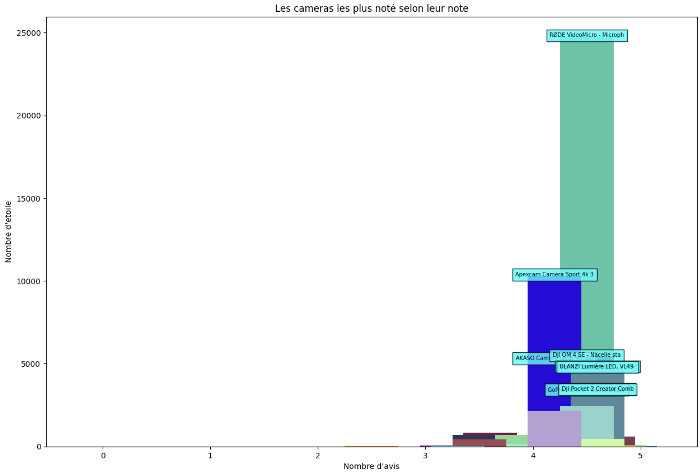

# Scrap_amazon
Le but est de Recupèrer la liste des produits suite une recherche  
Nous allons alors scraper amazon el leader du e-commerce
et faire un graphe facilitant le choix du produit à acheter

# Le dataset
Il sera generer au fil du projet, il reprendra les produits d'une categorie en passant dans les 5 première page.
Il est dans le dossier `dataset/`


# Application
l'app pyhton `app.py` gère le traitement des données de A à Z
- Scrap sur amazon les données
- formatage des données
- implémentation de celle-ci dans un dataframe
- transformation en fichier `.csv`

le fichier `demo.ipynb`est simplement la pour tester les fonction contenu dans le `app.py`.

Nous avons également le `stats.ipynb` qui va rendre visuelles les données recuperer en se basant sur le csv.

Il met donc les données en forme avec un graph permettant de trouvé les meilleurs produits de la catégories

> L'objectif sera de pouvoir le faire sur n'importe qu'elle produit high-tech



# Utilisation
l'appication se lance pour le moment avec 
```bash
python app.py
```
Plusieurs possibilité s'offre à vous :
- vous pouvez scraper les données sur amazon
- ou utiliser le dataset disponible qui à été implementé par scraping

> des questions vous seront poser afin de vous guider 
> La partie scraping rencontre parfois un soucis sur une données particulières, il faudra alors relancer le programme, une simple boucle de requet ne fonctionne pas


